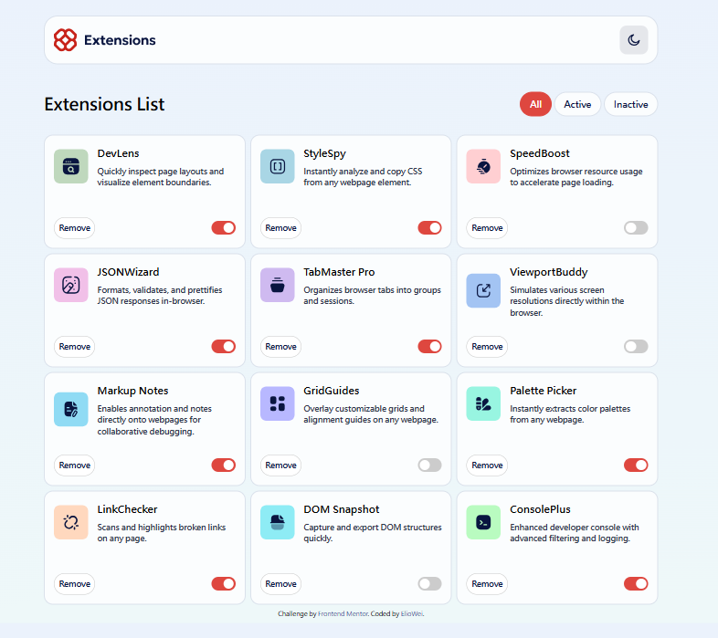
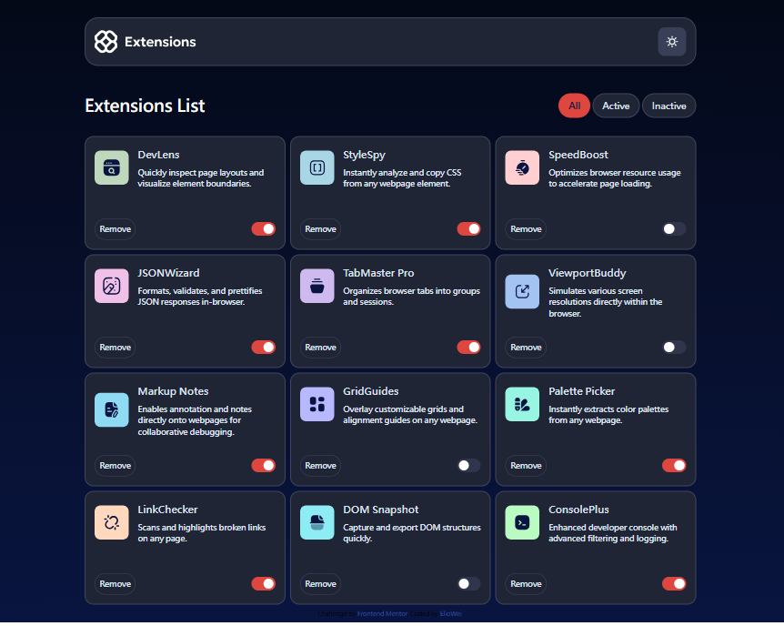

# Frontend Mentor - Browser Extension Manager UI Solution

[TW 中文](README.md)
[🇬🇧 English](README-en.md)

This is my solution to the [Browser Extension Manager UI Challenge](https://www.frontendmentor.io/challenges/browser-extension-manager-ui-yNZnOfsMAp) on Frontend Mentor. Frontend Mentor challenges .

## Table of Contents

- [Overview](#Overview)
  - [Challenge Requirements](#Challenge-Requirements)
  - [Screenshots](#Screenshots)
  - [Links](#Links)
- [Development Process](#Development-Process)
  - [Technologies Used](#Technologies-Used)
  - [Lessons Learned](#Lessons-Learned)
  - [Useful Resources](#Useful-Resources)
- [Acknowledgments](#Acknowledgments)

## Overview

### Challenge Requirements

Users should be able to:

- Toggle the activation status of extensions in the list
- Filter the displayed extensions based on their status (enabled/disabled)
- Reset the extension list to its default state
- Choose different theme colors (e.g., light mode, dark mode)
- View a responsive layout optimized for different screen sizes (RWD)
- See hover and focus states for all interactive elements

### Screenshots

### Links

Solution URL: [Click here](https://github.com/eliowei/Browser-extension-manager-UI?tab=readme-ov-file)

Live Demo: [Click here](https://eliowei.github.io/Browser-extension-manager-UI/)

## Development Process

### Technologies Used

- Semantic HTML5 markup

- TailwindCSS

- SASS

- Flexbox

- CSS Grid

- Responsive Web Design (Mobile, Desktop)

- JavaScript

### Lessons Learned

Through this Frontend Mentor project, I gained hands-on experience with JavaScript and TailwindCSS, especially in implementing responsive design (RWD).

One key takeaway was learning how to implement functionality purely with vanilla JavaScript without using frameworks like Vue. I focused on breaking down the features into smaller parts and implementing them step by step.

### Useful Resources

CSS Tricks - Helped me understand Flexbox layouts.

MDN Web Docs - Provided official documentation for HTML, CSS, and JavaScript.

Frontend Mentor Community - Allowed me to explore solutions from other developers and get inspiration.

## Acknowledgments

A huge thanks to everyone who provided help and inspiration, especially Frontend Mentor for offering this great practice project! 🚀

If you have any suggestions or feedback on my solution, feel free to share your thoughts!
